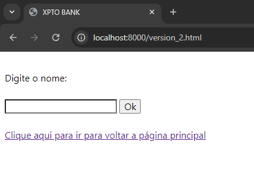
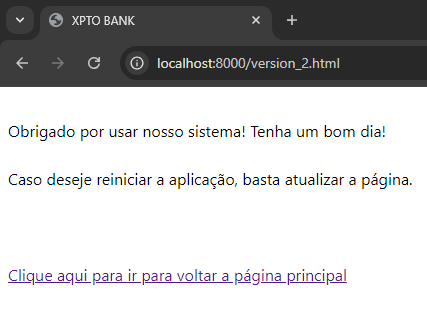

# Criando um Sistema Bancário com python | pyscript | github pages

<a href="https://amorim-cyber.github.io/NTT_DIO_XPTO_Bank/version_2.html">CLIQUE AQUI PARA INTERAGIR COM O PROJETO VERSÃO 2</a>

<a href="https://amorim-cyber.github.io/NTT_DIO_XPTO_Bank/version_1.html">CLIQUE AQUI PARA INTERAGIR COM O PROJETO VERSÃO 1</a>

### Introdução:

Esta é uma solução para um dos desafios de projeto propostos pela Digital Inovation One (DIO). 

A ideia é criar um sistema bancário simples contendo as seguintes operações:
- Visualizar Extrato
- Efetuar Saque
- Efetuar Deposito
- Listar Usuários Cadastrados
- Cadastrar Usuário
- Cadastrar Conta

Conforme foi proposto, a aplicação foi desenvolvida utilizando a linguagem `Python`. Contudo resolvi adicionar os recursos do `pyscript` e do `github pages` para uma melhor experiência.

### Sobre pyscript e github pages:

O pyscript permite que seja possível executar scripts python dentro de um browser.

Já o github pages fornece hospedagem sem custo para projetos web de baixo porte.

A motivação de usar essas duas ferramentas é trazer para mais perto o produto final para o usuário, sinalizar que o que foi desenvolvido está funcionando sem problemas.

Logo uma aplicação que normalmente só poderia ser executada localmente, agora pode ser compartilhada a todos com a união desses dois recursos.

Caso você achou legal a ideia e deseja incluir em seu projeto, <a href="https://m.youtube.com/watch?v=dmIWFcJ2UTI">este vídeo</a> ensina de forma rápida e simples como implementar. 

Também deixo <a href="https://docs.pyscript.net/2024.2.1/user-guide/offline/" >aqui</a> como você pode executar o Pycript via localhost sem precisar da ferramenta do codespaces do github.

### Sobre o sistema bancário:

#### - Menu -

Ao clicar no <a href="https://amorim-cyber.github.io/NTT_DIO_XPTO_Bank/version_2.html">link</a> do projeto, aparecerá na tela o seguinte menu:

 
O usuário terá a opção de ver seu extrato, sacar uma quantia, depositar uma quantia, listar usuarios, criar um usuario, criar uma conta e sair do programa. Por hora, estamos apenas testando a funcionalidade das operações sem ainda ter uma ligação entre elas.

Temos uma caixa de texto aonde irá acontecer a interação. É importante mencionar que o programa somente vai aceitar apenas o que está indicado em [ ], qualquer caracter diferente disso vai trazer a seguinte mensagem abaixo:

#### - Extrato -

Se incluimos o valor "1" na caixa de texto e clicar em Ok iremos para a tela de extrato. Estamos colocando uma condição de que o sistema sempre vai iniciar com R$ 1200.00 no extrato, e conforme vai acontecendo a interação (saque ou deposito), o saldo final vai sendo modificado. 

Abaixo temos a situação onde ainda não ocorreu saques ou depositos. 

#### - Saque -

Voltando para o menu principal, ao digitar a opção "2", vamos para a operação de saque, o programa ira pedir o valor da quantia a ser sacada conforme pode ser observado logo abaixo:

 
Em relação a operação de saque, foi solicitado que incluissemos as seguintes regras:
<ol>
<li> O usuário pode fazer até 3 saques diários, acima desse número há é mais possível efetuar saques.</li>
<li> Os saques não podem superar valores acima de R$ 500.00</li>
</ol>

Após declarar o montante que deseja sacar, o valor será descontado do saldo inicial e atividade adicionada ao extrato.

Vale comentar que o programa só vai aceitar valores inteiros positivos no momento do saque, qualquer valor diferente disso vai retornar um erro.

Ocorrerá também um erro caso o usuário queira sacar um valor superior ao saldo que ele tem no momento.

#### - Deposito - 

A opção "3" dentro do menu principal leva para a operação de deposito, o procedimento é parecido com do saque, a diferença é que teremos um acrescimo de valor e sua movimentação adicionada ao extrato. 

A regra de input continua a mesma: Não é permitido colocar valores que não sejam numero inteiros positivos.

Como disse acima, movimentamentações tanto de saque quanto de depósito modificam o saldo da conta.

Foi posto um limite para o total de operações. Caso a soma de todos os saques e depositos chegue a 10, o usuário não será mais capaz de executar uma nova operação.

Após algumas operações realizadas, se formos consultar o extrato, haverá uma listagem das movimentações junto com os valores de saldo inicial e final conforme pode ser visualizado abaixo:

#### - Listar Usuários -

O sistema tem a opção de listar os usuários que foram cadastrados, no momento inicial a tela terá essa aparência conforme mostrado abaixo:

 
Conforme novos usuários vão sendo cadastrados a listagem terá uma chamada diferente.

#### - Cadastrar Usuário -

O sistema consegue guardar os seguintes dados:

<ul>
<li>Nome</li>
<li>CPF</li>
<li>Data de nascimento</li>
<li>Endereço</li>
</ul>

O CPF é um dado obrigatório e único por usuário, o programa não ira aceitar cadastros com um mesmo CPF. Endereço é um conjunto dos dados logradouro, bairro, cidade e sigla estado.

O usuário vai preenchendo as informações de forma sequencial, um dado de cada vez.

#### - Cadastrar Conta -

O cadastro de conta segue a mesma lógica, primeiro é necessário digitar a conta que deseja cadastrar e o cpf do usuário que será dono. Um usuário pode ter mais de uma conta.

Uma conta obrigatóriamente precisa ter vinculo com um usuário ja cadastrado no sistema, caso contrário haverá erro.

Após cadastrado um novo usuário e conta, a listagem ficará com a seguinte cara:

#### - Sair -

Por fim temos a opção de sair se digitarmos "0", uma vez selecionado o programa é encerrado e toda informação inserida deletada.

### Encerramento:

Se você você chegou até aqui e curtiu o projeto não deixe de dar uma estrela :star:

Obrigado! :smile:
